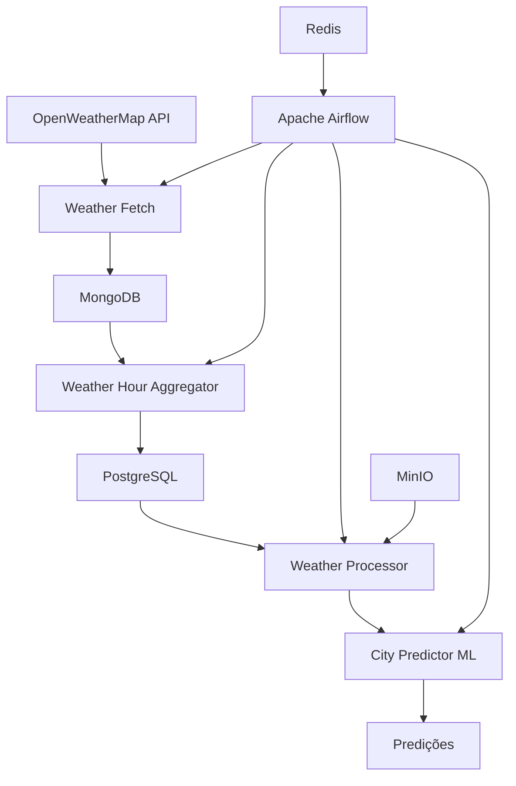

# Pipeline IoT para Previsão de Chuvas 🌦️

Sistema completo de pipeline IoT para coleta, processamento e previsão de dados meteorológicos usando Apache Airflow, PostgreSQL, MongoDB, MinIO e Machine Learning.

## 🏗️ Arquitetura



## 🚀 Funcionalidades

- **Coleta de Dados**: Extração automática de dados meteorológicos da API OpenWeatherMap
- **Armazenamento**: 
  - MongoDB para dados brutos (JSON)
  - PostgreSQL para dados estruturados
  - MinIO para armazenamento de objetos
- **Processamento**: Agregação horária e limpeza de dados usando Apache Spark
- **Machine Learning**: Modelos SARIMAX para previsão de temperatura por cidade
- **Orquestração**: Pipeline automatizado com Apache Airflow
- **Monitoramento**: Logging estruturado e métricas de performance

## 📋 Pré-requisitos

- Docker e Docker Compose
- Python 3.10+
- Make (opcional, mas recomendado)

## 🛠️ Instalação e Configuração

### 1. Clone o repositório
```bash
git clone <repository-url>
cd IOT
```

### 2. Configure as variáveis de ambiente
```bash
cp .env.example .env
# Edite o arquivo .env com suas configurações
```

### 3. Inicie os serviços
```bash
# Usando Make (recomendado)
make start

# Ou usando Docker Compose diretamente
docker-compose -f docker-compose-iot.yml up -d
```

### 4. Configure o ambiente Python (desenvolvimento local)
```bash
make setup-env
source venv/bin/activate
```

## 🔧 Uso

### Pipeline Completo (Local)
```bash
# Execute o pipeline completo
make run-pipeline

# Ou diretamente
python main.py
```

### Componentes Individuais
```bash
# Apenas coleta de dados
make run-fetch

# Apenas agregação horária
make run-aggregate

# Executar testes
make test
```

### Interface Web

- **Airflow UI**: http://localhost:8080 (admin/admin123)
- **MinIO Console**: http://localhost:9001 (minioadmin/minioadmin123)

## 📊 Fluxo de Dados

### 1. Extração (Weather Fetch)
- Coleta dados de 50+ cidades globalmente
- Salva dados brutos no MongoDB
- Frequência: A cada hora

### 2. Agregação (Weather Hour)
- Processa dados do MongoDB usando Spark
- Agrega por coordenadas e hora
- Salva dados estruturados no PostgreSQL

### 3. Processamento (Weather Processor)
- Limpeza e validação de dados
- Feature engineering
- Preparação para ML

### 4. Machine Learning (City Predictor)
- Modelos SARIMAX por cidade
- Previsão de temperatura 24h
- Métricas de performance (MAE, RMSE, R²)

## 🏗️ Estrutura do Projeto

```
IOT/
├── src/                          # Código fonte
│   ├── weather_fetch.py         # Coleta de dados da API
│   ├── weather_hour.py          # Agregação horária com Spark
│   ├── config.py                # Configurações centralizadas
│   ├── data_processing/         # Processamento de dados
│   │   └── weather_processor.py
│   ├── ml/                      # Modelos de Machine Learning
│   │   └── city_predictor.py
│   └── utils/                   # Utilitários
│       ├── logger.py
│       ├── database.py
│       └── minio_client.py
├── dags/                        # DAGs do Airflow
│   └── weather_iot_pipeline_dag.py
├── docker/                      # Configurações Docker
│   ├── airflow/
│   └── init-db.sql
├── notebooks/                   # Jupyter Notebooks
├── tests/                       # Testes unitários
├── main.py                      # Script principal
├── docker-compose-iot.yml       # Configuração Docker
├── Makefile                     # Comandos automatizados
└── requirements-pipeline.txt    # Dependências Python
```

## 🔍 Monitoramento e Logs

### Visualizar Logs
```bash
# Todos os serviços
make logs

# Serviço específico
make logs-postgres
make logs-mongodb
make logs-minio
```

### Status dos Serviços
```bash
make status
```

### Monitoramento de Recursos
```bash
make monitor
```

## 📈 Métricas de ML

O sistema registra automaticamente:
- **MAE** (Mean Absolute Error): Erro médio absoluto
- **RMSE** (Root Mean Square Error): Raiz do erro quadrático médio
- **R²** (Coeficiente de Determinação): Qualidade do ajuste

## 🧪 Testes

```bash
# Todos os testes
make test

# Apenas testes unitários
make test-unit

# Com cobertura de código
pytest tests/ --cov=src --cov-report=html
```

## 🐳 Docker Services

| Serviço | Porta | Descrição |
|---------|-------|-----------|
| PostgreSQL | 5432 | Banco principal para dados estruturados |
| MongoDB | 27017 | Armazenamento de dados brutos (JSON) |
| MinIO | 9000/9001 | Armazenamento de objetos |
| Redis | 6379 | Cache e message broker |
| Airflow DB | 5433 | Banco do Airflow |

## 🔧 Desenvolvimento

### Configuração de Desenvolvimento
```bash
make dev-setup
```

### Reset Completo
```bash
make dev-reset
```

### Formatação de Código
```bash
make format
make lint
```

## 📝 Configuração Avançada

### Spark Configuration
- Executor Memory: 2GB (configurável via .env)
- Driver Memory: 1GB (configurável via .env)
- Master: local[*] (usa todos os cores disponíveis)

### Airflow Configuration
- Schedule: @hourly (a cada hora)
- Max Active Runs: 1
- Retries: 3 com delay de 5 minutos

## 🚨 Troubleshooting

### Problemas Comuns

1. **Erro de permissões nos logs**:
   ```bash
   chmod 755 logs/
   # ou use o diretório alternativo automaticamente
   ```

2. **Erro de conexão com banco**:
   ```bash
   make start  # Certifique-se que os serviços estão rodando
   make status # Verifique status dos containers
   ```

3. **Erro no Spark**:
   ```bash
   # Verifique se o Java está instalado corretamente
   docker-compose -f docker-compose-iot.yml logs mongodb
   ```

### Backup e Restauração
```bash
# Backup do banco
make backup-db

# Acesso direto aos bancos
make shell-postgres
make shell-mongodb
```

## 📄 Licença

Este projeto está licenciado sob a MIT License.

## 🤝 Contribuição

1. Fork o projeto
2. Crie sua feature branch (`git checkout -b feature/AmazingFeature`)
3. Commit suas mudanças (`git commit -m 'Add some AmazingFeature'`)
4. Push para a branch (`git push origin feature/AmazingFeature`)
5. Abra um Pull Request

## 📞 Suporte

Para suporte e dúvidas, consulte:
- Documentação do Airflow: https://airflow.apache.org/docs/
- Documentação do Spark: https://spark.apache.org/docs/latest/
- Issues do GitHub: [Link para issues]
